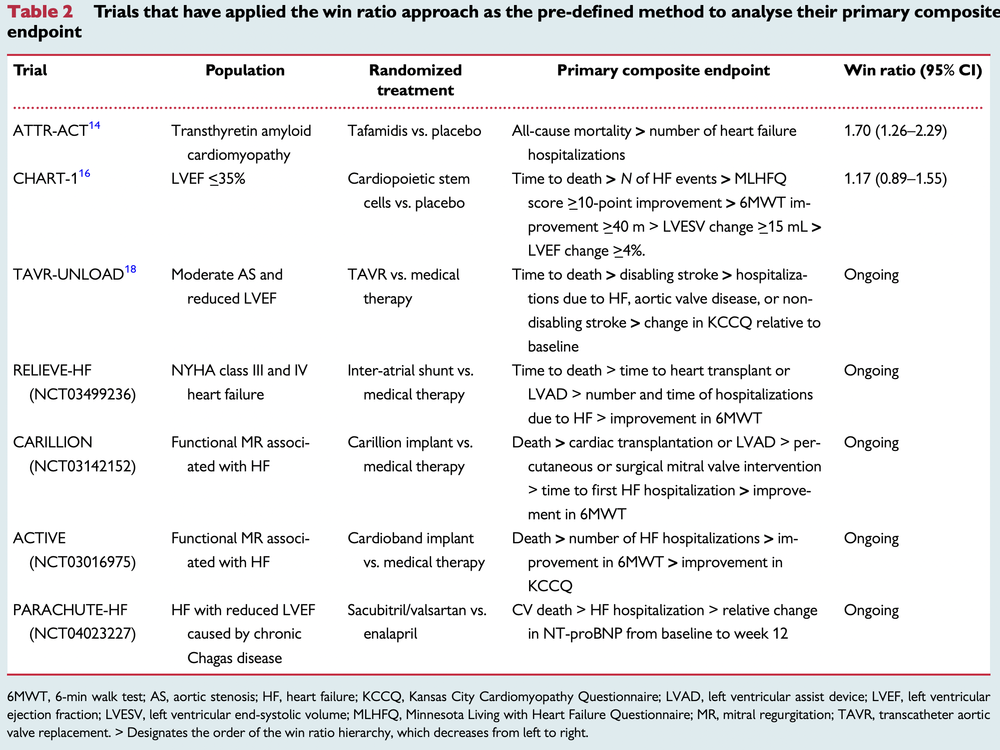

## Win Ratio References

Win ratio is a novel approach to analyze prioritized composite endpoints. After proposed by Pocock et al. (2012), it gained much attention in both academic and industry. I summarized some important references regarding win ratio statistics.

### Theory

**Background:**

- [Combining mortality and longitudinal measures in clinical trials.](https://onlinelibrary.wiley.com/doi/abs/10.1002/%28SICI%291097-0258%2819990615%2918%3A11%3C1341%3A%3AAID-SIM129%3E3.0.CO%3B2-7), Finkelstein and Schoenfeld (1999)

- [Generalized pairwise comparisons of prioritized outcomes in the two-sample problem.](https://onlinelibrary.wiley.com/doi/abs/10.1002/sim.3923), Buyse (2010)

**Original paper:** [The win ratio: a new approach to the analysis of composite endpoints in clinical trials based on clinical priorities](https://academic.oup.com/eurheartj/article/33/2/176/439013), Pocock et al. (2012)

**Analytic variance formulas for win ratio:** 

- [Large sample inference for a win ratio analysis of a composite outcome based on prioritized components](https://academic.oup.com/biostatistics/article/17/1/178/1744479), Bebu and Lachin (2015)

- [An alternative approach to confidence interval estimation for the win ratio statistic](https://onlinelibrary.wiley.com/doi/full/10.1111/biom.12225), Luo et al. (2015)

- [A generalized analytic solution to the win ratio to analyze a composite endpoint considering the clinical importance order among components](https://onlinelibrary.wiley.com/doi/full/10.1002/pst.1763?casa_token=7OaTK3AD2W4AAAAA%3AAJDGGnu-lzjcqN00i1dMqqbwR5ae-7oOXP1P9lswjjlyS2nw64-mRgLMYHthn34oHjaf6A604n-VI2c), Dong (2016). 

- [The asymptotic distribution of the Net Benefit estimator in presence of right-censoring](https://journals.sagepub.com/doi/full/10.1177/09622802211037067?casa_token=kaVqsz-TshQAAAAA%3AvxrzjkiQxqKIl3f7_tPmfZSAz_1hvKLVtSdXneXl1KcxohOPrYnVFwXjGSN8TsiRk0S8Pw-dfLmThQ4), Ozenne (2021).

- [https://link.springer.com/article/10.1007/s42081-021-00131-1](https://link.springer.com/article/10.1007/s42081-021-00131-1), Zhang and Jeong (2021)

**Alternative hypothesis:** [On the alternative hypotheses for the win ratio](https://onlinelibrary.wiley.com/doi/abs/10.1111/biom.12954), Mao (2019)

**Weighted win ratio:**

- [Weighted win loss approach for analyzing prioritized outcomes](https://onlinelibrary.wiley.com/doi/abs/10.1002/sim.7284), Luo et al. (2017)

- [Some Meaningful Weighted Log-Rank and Weighted Win Loss Statistics](https://link.springer.com/article/10.1007/s12561-020-09273-4), Luo and Quan (2020)

**Stratified win ratio:** [The stratified win ratio](https://www.tandfonline.com/doi/abs/10.1080/10543406.2017.1397007?journalCode=lbps20#:~:text=Consider%20a%20clinical%20trial%20with,2%2C%20%E2%80%A6%2C%20M), Dong (2017)

**Dependency on follow-up time:**

- [On the win-ratio statistic in clinical trials with multiple types of event](https://academic.oup.com/biomet/article-abstract/103/3/742/1743978?redirectedFrom=fulltext), Oakes (2016)

- [Graphing the win ratio and its components over time](https://onlinelibrary.wiley.com/doi/abs/10.1002/sim.7895), Finkelstein and Schoenfeld (2019)

- [Adjusting win statistics for dependent censoring](https://onlinelibrary.wiley.com/doi/abs/10.1002/pst.2086), Dong et al. (2020)

- [The inverse-probability-of-censoring weighting (IPCW) adjusted win ratio statistic: an unbiased estimator in the presence of independent censoring](https://www.tandfonline.com/doi/abs/10.1080/10543406.2020.1757692), Dong et al. (2020)

- [The win ratio: Impact of censoring and follow‐up time and use with nonproportional hazards](https://onlinelibrary.wiley.com/doi/full/10.1002/pst.1977?casa_token=FoLNO8bdSwkAAAAA%3Ahrpi3ENz_dkOXGHpKUKHJiOgP4ePBDgf04_rssrCMtHE9PJw6H-QGGieJxzAPQdH3vCpqoyUUaCZ_aY), Dong et al. (2019)

**Handling of Ties:** 

- [The Win Ratio: On Interpretation and Handling of Ties](https://www.tandfonline.com/doi/abs/10.1080/19466315.2019.1575279?journalCode=usbr20), Dong (2019)

- [Win odds: An adaptation of the win ratio to include ties](https://onlinelibrary.wiley.com/doi/full/10.1002/sim.8967?casa_token=aZWSuQx0R-sAAAAA%3A7pSCiZkAZVs2AaHpxSNLXi2k2E2Hcjkw6s2j63DnJCWvnwKQ08nBulZCeLfaD2gUF1RQb4Iscsk4-Q8), Brunner (2021)

**Sample size calculation:** 

- [Sample size formula for general win ratio analysis](https://onlinelibrary.wiley.com/doi/abs/10.1111/biom.13501), Mao (2021)

- [Sample size formula for a win ratio endpoint](https://onlinelibrary.wiley.com/doi/abs/10.1002/sim.9297), Yu and Ganju (2022)

**Regression:** 

- [A class of proportional win-fractions regression models for composite outcomes](https://onlinelibrary.wiley.com/doi/abs/10.1111/biom.13382), Mao and Wang (2020)

- Stratified Proportional Win-fractions Regression Analysis, Wang and Mao (2022+)

**Review:**

- [Statistical Models for Composite Endpoints of Death and Nonfatal Events: A Review](https://www.tandfonline.com/doi/abs/10.1080/19466315.2021.1927824), Mao and Kim (2021)

### Application

Overview:

  - The win ratio approach for composite endpoints: practical guidance based on previous experience,[paper](https://academic.oup.com/eurheartj/article-abstract/41/46/4391/5903165?redirectedFrom=fulltext)

Urology:

  - Effect of Metabolic Syndrome on Anatomy and Function of the Lower Urinary Tract Assessed on MRI, [paper (2022)](https://www.sciencedirect.com/science/article/pii/S009042952100892X?casa_token=GntC6JflwAoAAAAA:2nfyjLx5C_u9OlbvQNSCgfTUNjgPIphaQnudwcXqHTUKMlj2LzgwVCIvmmwtb4RhobkcOuUTKfNT)

COVID-19:

  - Revista Científica Hospital Santa Izabel: Therapeutic versus Prophylactic Anticoagulation for Patients Admitted to Hospital with COVID-19 and Elevated D-dimer Concentration (ACTION): An Open-Label, Multicentre, Randomised, Controlled Trial, [paper (2021)](https://www.sciencedirect.com/science/article/pii/S0140673621012034?casa_token=tAbiNA4i7EgAAAAA:iiZtYLiV_elqKkRkuZ55EKl_h0-cPgZjTjpS0pG-MLX9FAfAedbcvCI88ipnuJtX-P3JKzb8qXyX)
  
  - Dapagliflozin in patients with cardiometabolic risk factors hospitalised with COVID-19 (DARE-19): a randomised, double-blind, placebo-controlled, phase 3 trial, [paper (2021)](https://www.sciencedirect.com/science/article/pii/S2213858721001807)

Cardiovascular Disease related clinical trial:

  - Atrial shunt device for heart failure with preserved and mildly reduced ejection fraction (REDUCE LAP-HF II): a randomised, multicentre, blinded, sham-controlled trial, [paper (2022)](https://www.sciencedirect.com/science/article/pii/S0140673622000162?casa_token=Oxi5uZt_9jcAAAAA:KV3_mvi07Y0m4BjB3-Yg4nrEHxaA7jXs19kfF2kllpeGbsChU8zFkUh0FCn6VMyPj-YVzHG3scu7)
  
  - Outpatient diuretic intensification as endpoint in heart failure with preserved ejection fraction trials: an analysis from TOPCAT, [paper (2021)](https://onlinelibrary.wiley.com/doi/epdf/10.1002/ejhf.2376)
  
  - Sodium–glucose co-transporter 2 inhibition in patients hospitalized for acute decompensated heart failure: rationale for and design of the EMPULSE trial, [paper (2021)](https://onlinelibrary.wiley.com/doi/full/10.1002/ejhf.2137), <i>sponsored by Boehringer Ingelheim</i>.

  - Tafamidis Treatment for Patients with Transthyretin Amyloid Cardiomyopathy, [paper (2018)](https://www.nejm.org/doi/full/10.1056/NEJMoa1805689), <i>ATTR-ACT trial, funded by Pfizer</i>.
  
  - Statistical Appraisal of 6 Recent Clinical Trials in Cardiology: JACC State-of-the-Art Review, [paper](https://www.sciencedirect.com/science/article/pii/S0735109719347205?via%3Dihub), <i>described how the ATTR-ACT trial used win ratio</i>.
  
  - Cardiopoietic cell therapy for advanced ischaemic heart failure: results at 39 weeks of the prospective, randomized, double blind, sham-controlled CHART-1 clinical trial, [paper (2017)](https://www.ncbi.nlm.nih.gov/pmc/articles/PMC5381596/), <i>used a Finkelstein-Schoenfeld approach</i>

  - Applying novel methods to assess clinical outcomes: insights from the TRILOGY ACS trial, [paper (2014)](https://academic.oup.com/eurheartj/article/36/6/385/445850), <i>reanalyzed the results using win ratio</i>

  - The win ratio approach to analyzing composite outcomes: An application to the EVOLVE trial, [paper (2016)](https://www.sciencedirect.com/science/article/pii/S1551714416300489?casa_token=qJIvmltRtgEAAAAA:dVhV7TziNHvrSVwu7xyUZrbeDNoTEg_-y7xBSaowrxqIaT7G5mIkYrfIz1-mqE1fnGqKcJkHGA), <i>reanalyzed the results using win ratio</i>
  
  - Use of the win ratio in cardiovascular trials, [paper (2020)](https://www.sciencedirect.com/science/article/pii/S221317792030202X?via%3Dihub) <i>reanalyzed several CV trials using win ratio</i>

  - Hierarchical testing of composite endpoints: applying the win ratio to percutaneous coronary intervention versus coronary artery bypass grafting in the SYNTAX trial, [paper (2017)](https://pubmed.ncbi.nlm.nih.gov/28134125/)

Other:

  - Rationale and design of the safe and timely antithrombotic removal - ticagrelor (STAR-T) trial: A prospective, multi-center, double-blind, randomized controlled trial evaluating reductions in postoperative bleeding with intraoperative removal of ticagrelor by the drugsorb™-ATR device in patients undergoing cardiothoracic surgery within 48 hours from last ticagrelor dose, [paper(2022)](https://www.sciencedirect.com/science/article/pii/S0002870321004427)
  
  - Transcatheter Aortic-Valve Implantation for Aortic Stenosis in Patients Who Cannot Undergo Surgery, [paper (2010)](https://www.nejm.org/doi/10.1056/NEJMoa1008232?url_ver=Z39.88-2003&rfr_id=ori:rid:crossref.org&rfr_dat=cr_pub%20%200www.ncbi.nlm.nih.gov), <i>used a Finkelstein-Schoenfeld approach</i>

  - [A win ratio approach to comparing continuous non-normal outcomes in clinical trials](https://onlinelibrary.wiley.com/doi/abs/10.1002/pst.1743), <i>used win ratio to reanalyze two clinical trials, CHARM and PLACIDE </i>

Trials that have applied the win ratio approach as the pre-defined method to analyse their primary composite endpoint. <i>(table 2 in Redfors et al. 2020)</i>

Trials that have re-analysed their primary composite endpoint using the win ratio approach. <i>(table 3 in Redfors et al. 2020)</i>

### Software

- Win ratio regression R package: [WR](https://cran.r-project.org/web/packages/WR/index.html)

- R package [WINS](https://cran.uni-muenster.de/web/packages/WINS/vignettes/vignette.pdf)

- Weighted win ratio R package: [WWR](https://cran.r-project.org/web/packages/WWR/WWR.pdf), [paper](https://www.hoajonline.com/medicalstat/2053-7662/5/4)

- R package for computing confidence interval based on Bebu and Lachin (2016):[WinRatio](https://cran.r-project.org/web/packages/WinRatio/WinRatio.pdf)

- R code for computing confidence interval based on Luo et al. (2015): [R code](https://onlinelibrary.wiley.com/action/downloadSupplement?doi=10.1111%2Fbiom.12225&file=biom12225-sup-0001-SupData-S1.pdf)

- Supplemental material for Redfors, Björn, et al. "The win ratio approach for composite endpoints: practical guidance based on previous experience." [R code](https://github.com/CRF-Biostatistics/WinRatioApplications)

- Stata module to calculate the unmatched Win Ratio for prioritized outcomes: [website](https://econpapers.repec.org/software/bocbocode/s458984.htm)
