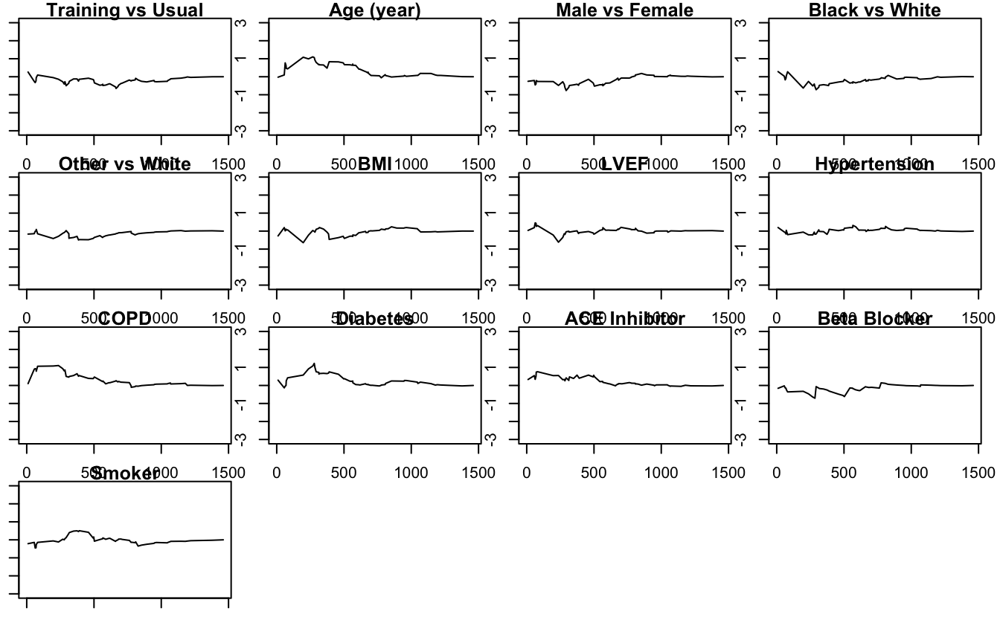

This is a self-contained, practical tutorial on the use of the `WR` package to fit a priority-adjusted proportional win-fractions (PW) regression model for a composite endpoint consisting of death and non-fatal events. The model is a regression version of Pocock's two-sample win ratio (Pocock et al., 2012). The methodology is described in full detail and generality in Mao and Wang (2020).

Input data and regression function
----------------------------------

The input data for analysis should be arranged in the "long format", with an `ID` vector containing unique patient-level identifiers. In addition, we need a `time` vector containing the event times and a `status` vector indicating the corresponding cause of the event. The vector `status` should be coded as `1`=death; `2`=non-fatal event; `0`=censoring. In the case of recurrent non-fatal event, multiple rows with `status`=2 are allowed. However, by nature of the method, only time to the first episode will be used. Finally, we need a covariate matrix `Z` with the same row as `ID`. Each column of `Z` represents a covariate. All covariates need to be time-constant.

The main function to fit the PW model is [`pwreg(time,status, Z, ID)`](https://rdrr.io/pkg/WR/man/pwreg.html) with arguments in specified formats as above. The function returns an object of class `pwreg` with a `beta` vector for $\widehat{\boldsymbol\beta}$ and a `Var` matrix for $\text{var}(\widehat{\boldsymbol\beta})$. For details, refer to documentation of the `WR` package.

An example: HF-ACTION study
---------------------------

We consider a dataset from the HF-ACTION study consisting of 451 non-ischemic heart failure patients. The study was conducted between April 2003 through Feb 2007 at 82 sites in the USA, Canada, and France (O'Connor et al., 2009). The study objective was to assess the effect of adding aerobic exercise training to usual care on the patient's CV outcomes. The primary endpoint was a composite of all-cause death and all-cause hospitalization.

We first load the `WR` package and the analysis dataset `non_ischemic`.

<pre class='chroma'><code class='language-r' data-lang='r'><a href='https://rdrr.io/r/base/library.html'>library</a>(WR)

#&gt; Loading required package: survival

<a href='https://rdrr.io/r/utils/head.html'>head</a>(non_ischemic)

#&gt;   ID time status trt_ab age sex Black.vs.White Other.vs.White   bmi bipllvef
#&gt; 1  1  221      2      0  62   1              0              0 25.18    32.24
#&gt; 2  1  383      0      0  62   1              0              0 25.18    32.24
#&gt; 3  2   23      2      0  75   1              1              0 22.96    21.71
#&gt; 4  2 1400      0      0  75   1              1              0 22.96    21.71
#&gt; 5  5    7      2      0  48   1              1              0 34.37    22.97
#&gt; 6  5   10      1      0  48   1              1              0 34.37    22.97
#&gt;   hyperten COPD diabetes acei betab smokecurr
#&gt; 1        0    0        0    0     1         1
#&gt; 2        0    0        0    0     1         1
#&gt; 3        1    0        0    0     1         0
#&gt; 4        1    0        0    0     1         0
#&gt; 5        1    0        0    0     1         0
#&gt; 6        1    0        0    0     1         0
</code></pre>

We re-label the covariates with informative names.

<pre class='chroma'><code class='language-r' data-lang='r'><a href='https://rdrr.io/r/base/colnames.html'>colnames</a>(non_ischemic)[4:16]=<a href='https://rdrr.io/r/base/c.html'>c</a>(
  "Training vs Usual","Age (year)","Male vs Female","Black vs White", 
  "Other vs White", "BMI","LVEF","Hypertension","COPD","Diabetes",
  "ACE Inhibitor","Beta Blocker", "Smoker"
)
</code></pre>

Compute the sample size the median length of follow-up.

<pre class='chroma'><code class='language-r' data-lang='r'># sample size
<a href='https://rdrr.io/r/base/length.html'>length</a>(<a href='https://rdrr.io/r/base/unique.html'>unique</a>(non_ischemic$ID))

#&gt; [1] 451

# median length of follow-up time
<a href='https://rdrr.io/r/stats/median.html'>median</a>(non_ischemic$time[non_ischemic$status&lt;2])/30.5

#&gt; [1] 31.63934
</code></pre>

So we indeed have $n=451$ unique patients with a median follow-up of 31.6 months.

Next, we use the [`pwreg()`](https://rdrr.io/pkg/WR/man/pwreg.html) function to fit the PW model:

<pre class='chroma'><code class='language-r' data-lang='r'># get the number of rows and number of covariates.
nr &lt;- <a href='https://rdrr.io/r/base/nrow.html'>nrow</a>(non_ischemic)
p &lt;- <a href='https://rdrr.io/r/base/nrow.html'>ncol</a>(non_ischemic)-3

# extract ID, time, status and covariates matrix Z from the data.
# note that: ID, time and status should be column vector.
# covariatesZ should be (nr, p) matrix.
ID &lt;- non_ischemic[,"ID"]
time &lt;- non_ischemic[,"time"]
status &lt;- non_ischemic[,"status"]
Z &lt;- <a href='https://rdrr.io/r/base/matrix.html'>as.matrix</a>(non_ischemic[,4:(3+p)],nr,p)

# pass the parameters into the function
pwreg.obj &lt;- <a href='https://rdrr.io/pkg/WR/man/pwreg.html'>pwreg</a>(time=time,status=status,Z=Z,ID=ID)
<a href='https://rdrr.io/r/base/print.html'>print</a>(pwreg.obj)

#&gt; Call:
#&gt; pwreg(time = time, status = status, Z = Z, ID = ID)
#&gt; 
#&gt; Proportional win-fractions regression models for priority-adjusted composite endpoint
#&gt; 
#&gt;     (Mao and Wang, 2020+, under review):
#&gt; 
#&gt; Total number of pairs: 101475 
#&gt; Wins-losses on death:  7644 (7.5%) 
#&gt; Wins-losses on non-fatal event:  78387 (77.2%) 
#&gt; Indeterminate pairs 15444 (15.2%) 
#&gt; 
#&gt; Newton-Raphson algorithm converged in 5 iterations.
#&gt; 
#&gt; Overall test: chisq test with 13 degrees of freedom; 
#&gt;  Wald statistic 24.9 with p-value 0.02392931 
#&gt; 
#&gt; Estimates for Regression parameters:
#&gt; 
#&gt;                     Estimate         se z.value p.value  
#&gt; Training vs Usual  0.1906687  0.1264658  1.5077 0.13164  
#&gt; Age (year)        -0.0128306  0.0057285 -2.2398 0.02510 *
#&gt; Male vs Female    -0.1552923  0.1294198 -1.1999 0.23017  
#&gt; Black vs White    -0.3026335  0.1461330 -2.0709 0.03836 *
#&gt; Other vs White    -0.3565390  0.3424360 -1.0412 0.29779  
#&gt; BMI               -0.0181310  0.0097582 -1.8580 0.06316 .
#&gt; LVEF               0.0214905  0.0086449  2.4859 0.01292 *
#&gt; Hypertension      -0.0318291  0.1456217 -0.2186 0.82698  
#&gt; COPD              -0.4023069  0.2066821 -1.9465 0.05159 .
#&gt; Diabetes           0.0703990  0.1419998  0.4958 0.62006  
#&gt; ACE Inhibitor     -0.1068201  0.1571317 -0.6798 0.49662  
#&gt; Beta Blocker      -0.5344979  0.3289319 -1.6250 0.10417  
#&gt; Smoker            -0.0602350  0.1682826 -0.3579 0.72039  
#&gt; ---
#&gt; Signif. codes:  0 '***' 0.001 '**' 0.01 '*' 0.05 '.' 0.1 ' ' 1
#&gt; 
#&gt; 
#&gt; Point and interval estimates for for win ratios:
#&gt; 
#&gt;                   Win Ratio 95% lower CL 95% higher CL
#&gt; Training vs Usual 1.2100585    0.9444056     1.5504374
#&gt; Age (year)        0.9872513    0.9762288     0.9983983
#&gt; Male vs Female    0.8561648    0.6643471     1.1033663
#&gt; Black vs White    0.7388699    0.5548548     0.9839127
#&gt; Other vs White    0.7000951    0.3578286     1.3697431
#&gt; BMI               0.9820323    0.9634287     1.0009952
#&gt; LVEF              1.0217231    1.0045572     1.0391823
#&gt; Hypertension      0.9686721    0.7281543     1.2886357
#&gt; COPD              0.6687755    0.4460178     1.0027865
#&gt; Diabetes          1.0729362    0.8122757     1.4172433
#&gt; ACE Inhibitor     0.8986873    0.6604773     1.2228110
#&gt; Beta Blocker      0.5859634    0.3075270     1.1164977
#&gt; Smoker            0.9415433    0.6770144     1.3094312
</code></pre>

The output consists of three parts. The first part presents some descriptive statistics on the proportions of win-loss status among all ${n\choose 2}=101,475$ pairs. According to the output, $7.5\%$ of them are determined by death; $77.2\%$ by hospitalization, and the remaining $7.2\%$ are indeterminate. It also reports an overall (Wald) test with $p$-value 0.024, suggesting that, at the conventional 0.05 level, the 13 covariates are significantly associated with the composite outcome.

The second part presents a table for the estimates and standard errors of the regression coefficient, along with their corresponding $p$-value for testing the coefficient being zero. The third part is perhaps the most informative, tabulating the estimated win ratios (exponential of the regression coefficients) and their associated $95\%$ confidence intervals. We can see that a patient in exercise training is $21\%$ more likely to have a better priority-adjusted composite outcome than one in usual care. However, this difference is statistically not significant. In addition, younger age, white race, higher LVEF are significantly associated with more favorable outcomes than otherwise, while the beneficial effects of low BMI and absence of COPD history are border-line significant.

To assess the effect of race on the composite outcome, we test the null hypothesis $$H_0:\beta_4=\beta_5=0.$$ We conduct a 2-df Chi-square Wald test based on $(\widehat\beta_4,\widehat\beta_5)^{T}$:

<pre class='chroma'><code class='language-r' data-lang='r'>#extract estimates of (\beta_4,\beta_5)
beta &lt;- <a href='https://rdrr.io/r/base/matrix.html'>matrix</a>(pwreg.obj$beta[4:5])
#extract estimated covariance matrix for (\beta_4,\beta_5)
Sigma &lt;- pwreg.obj$Var[4:5,4:5]
#compute chisq statistic in quadratic form
chistats &lt;- <a href='https://rdrr.io/r/base/t.html'>t</a>(beta) %*% <a href='https://rdrr.io/r/base/solve.html'>solve</a>(Sigma) %*% beta  

#compare the Wald statistic with the reference
# distribution of chisq(2) to obtain the p-value
1 - <a href='https://rdrr.io/r/stats/Chisquare.html'>pchisq</a>(chistats, df=2)

#&gt;           [,1]
#&gt; [1,] 0.1016988
</code></pre>

The $p$-value is 0.102. So the overall effect of race on the composite outcome is non-significant.

Finally, we use the [`score.proc()`](https://rdrr.io/pkg/WR/man/score.proc.html) function to plot the standardized score process for each covariate:

<pre class='chroma'><code class='language-r' data-lang='r'>score.obj &lt;- <a href='https://rdrr.io/pkg/WR/man/score.proc.html'>score.proc</a>(pwreg.obj)
<a href='https://rdrr.io/r/base/print.html'>print</a>(score.obj)

#&gt; This object contains two components:
#&gt;  't': an l-vector of times
#&gt;  'score': a p-by-l matrix whose k'th row is the standardized score process for the k'th covariate
#&gt;           as a function of t
#&gt; 
#&gt; Use 'plot(object,k=k)' to plot the k'th score process.

 
<a href='https://rdrr.io/r/graphics/par.html'>par</a>(mar=<a href='https://rdrr.io/r/base/c.html'>c</a>(1,1,1,1))
oldpar &lt;- <a href='https://rdrr.io/r/graphics/par.html'>par</a>(mfrow = <a href='https://rdrr.io/r/graphics/par.html'>par</a>("mfrow"))
<a href='https://rdrr.io/r/graphics/par.html'>par</a>(mfrow = <a href='https://rdrr.io/r/base/c.html'>c</a>(4,4))
for(i in <a href='https://rdrr.io/r/base/c.html'>c</a>(1:13))&#123;
  <a href='https://rdrr.io/r/graphics/plot.default.html'>plot</a>(score.obj, k = i)
&#125;
<a href='https://rdrr.io/r/graphics/par.html'>par</a>(oldpar)

</code></pre>

Most curves are fairly patternless with suprema well bounded by 2. So we conclude that the proportionality assumption approximately holds.

References
----------

Mao, L. and Wang, T. (2020). "A class of proportional win-fractions regression models for composite outcomes". Biometrics, 10.1111/biom.13382.

O'Connor, C. M., Whellan, D. J., Lee, K. L., Keteyian, S. J., Cooper, L. S., Ellis, S. J., Leifer, E. S., Kraus, W. E., Kitzman, D. W., Blumenthal, J. A. et al. (2009). "Efficacy and safety of exercise training in patients with chronic heart failure: HF-ACTION randomized controlled trial". Journal of the American Medical Association, 301, 1439--1450.

Pocock, S., Ariti, C., Collier, T., and Wang, D. (2012). "The win ratio: a new approach to the analysis of composite endpoints in clinical trials based on clinical priorities". European Heart Journal, 33, 176--182.

